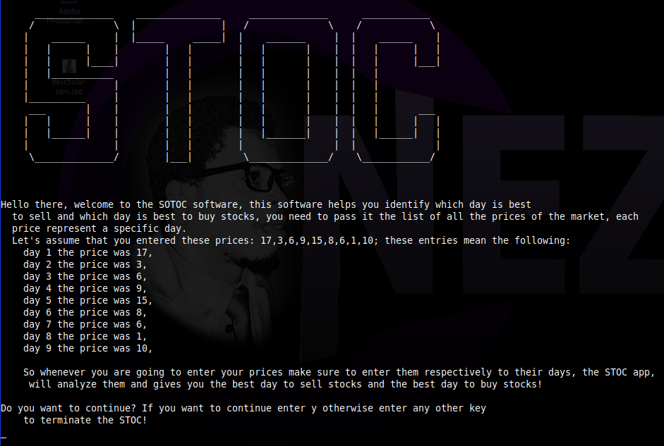

# stock-picker
  [](https://codeclimate.com/github/descholar-ceo/stock-picker/maintainability)


This is project is the implementation of the project found on theodinproject on this link: [theodinproject](https://www.theodinproject.com/courses/ruby-programming/lessons/stock-picker)

## Description of stock-picker

**stock-picker** (American English), **noughts and crosses** (British English), or **Xs and Os** is a [paper-and-pencil](https://en.wikipedia.org/wiki/Paper-and-pencil_stoc) stoc for two players, X and O, who take turns marking the spaces in a 3×3 grid. The player who succeeds in placing three of their marks in a horizontal, vertical, or diagonal row is the winner. [Read more on wikipedia...](https://en.wikipedia.org/wiki/stock-picker)

**This project is the implementation of that stock-picker, which is run on CLI (Command Line Interface), anyone can play it.**

|        stoc Board          |
-----------------------------|
|  |

## Built With
- Ruby

## How to open the stock-picker stoc
> This stoc can be used on directly your computer, please follow the following steps to get it run

#### Pre-requisites
1. You should have [Ruby](https://www.ruby-lang.org/en/) installed on your computer.
1. Your computer should be able to run `terminal` or `command prompt` or `bash` or `Powershell` commands.

#### 1. Using Our Release tag
1. [Click here](https://github.com/descholar-ceo/stock-picker/releases/tag/v1.0.b-beta) and download the zip file of this stoc
1. Unzip the downloaded file to the folder of your choice
1. Open terminal inside the unzipped folder
1. Run the following command to start the stoc:

```bash
    bin/main.rb
```
5. At that point you should see the stoc starting and follow the rules of the stoc.

#### 2. Using repository
1. Run this command `git clone https://github.com/descholar-ceo/stock-picker.git` to clone the repository to your local computer
1. Run `cd stock-picker` to go inside the stoc's folder
1. Run the following command to start the stoc:

```bash
    bin/main.rb
```
5. At that point you should see the stoc starting and follow the rules of the stoc.

## How to use stock-picker
This software helps you identify which day is best
  to sell and which day is best to buy stocks, you need to pass it the list of all the prices of the market, each
  price represent a specific day.
  Let's assume that you entered these prices: 17,3,6,9,15,8,6,1,10; these entries mean the following:
    day 1 the price was 17,
    day 2 the price was 3,
    day 3 the price was 6,
    day 4 the price was 9,
    day 5 the price was 15,
    day 6 the price was 8,
    day 7 the price was 6,
    day 8 the price was 1,
    day 9 the price was 10,

    So whenever you are going to enter your prices make sure to enter them respectively to their days, the STOC app,
     will analyze them and gives you the best day to sell stocks and the best day to buy stocks!

## Contributions

There are two ways of contributing to this project:

1.  If you see something wrong or not working, please check [the issue tracker section](https://github.com/descholar-ceo/stock-picker/issues ), if that problem you met is not in already opened issues then open the issue by clicking on `new issue` button.

2.  If you have a solution to that, and you are willing to work on it, follow the below steps to contribute:
    1.  Fork this repository
    1.  Clone it on your local computer by running `git clone https://github.com/your-username/stock-picker.git` __Replace *your username* with the username you use on github__
    1.  Open the cloned repository which appears as a folder on your local computer with your favorite code editor
    1.  Create a separate branch off the *master branch*,
    1.  Write your codes which fix the issue you found
    1.  Commit and push the branch you created
    1.  Raise a pull request, comparing your new created branch with our original master branch [here](https://github.com/descholar-ceo/stock-picker)

## Authors

👤 **Mugirase Emmanuel**

- Github: [@descholar-ceo](https://github.com/descholar-ceo)
- Twitter: [@descholar3](https://twitter.com/descholar3)
- Linkedin: [MUGIRASE Emmanuel](https://www.linkedin.com/in/mugirase-emmanuel-a90b49143)


## Show your support

Give a ⭐️ if you like this project!

## Acknowledgments

- [Microverse](https:www.microverse.org)
- [The Odin Project](https://www.theodinproject.com/)
